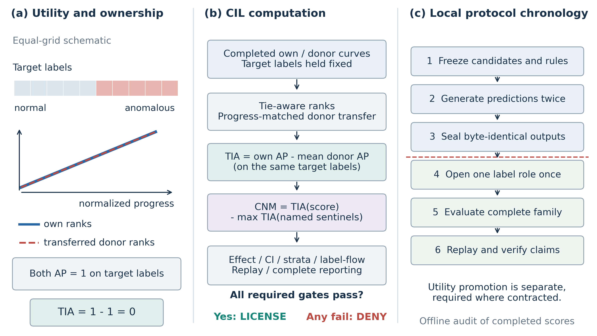
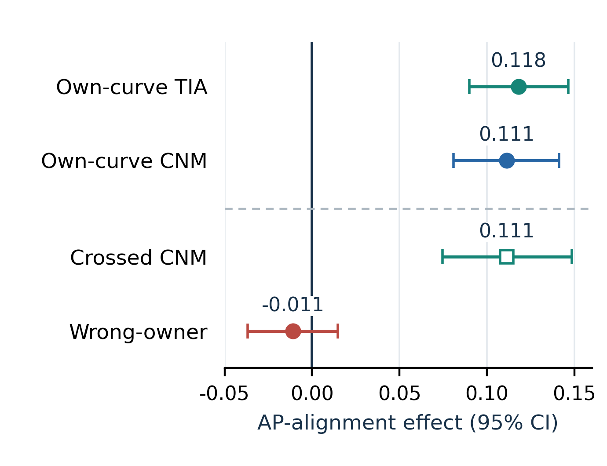
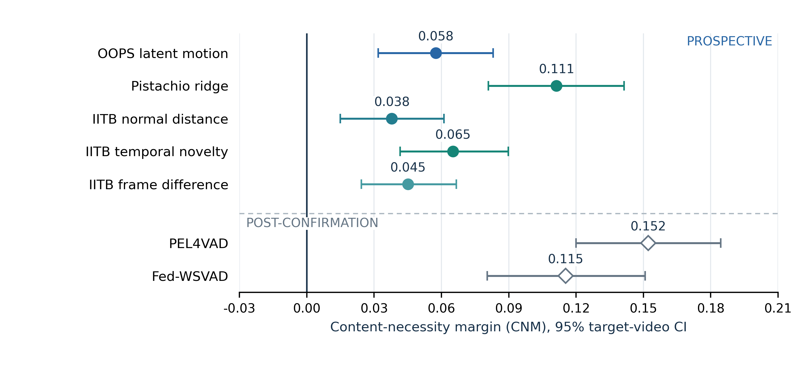

# CIL 自学讲义与第一阶段研究任务

这份材料直接面向加入项目的同学。你不需要先读懂整个仓库，也不需要重新训练模型。第一阶段是理解一个评价问题，重放三个已封存的结果，找出需要核验的假设；之后再与导师确定一项能进入论文的敏感性分析。

这里的 CIL 全称为 Content Identity Licensing。它是对已有视频异常分数的离线审计方法，不是新的检测模型。现有论文仍是待作者核验的工作稿；本材料既不承诺录用，也不把你的学习任务包装成已经完成的新科研成果。

## 1. 先思考：高分到底证明了什么？

设一段视频四个时刻的标签为 `[0, 0, 1, 1]`，0 是正常，1 是异常。模型给出的分数是 `[0.1, 0.2, 0.8, 0.9]`，分数越高表示越异常。

先不要往下看，写下你的答案：

1. 这条曲线是否把异常排在正常前面？
2. 假如另一个视频的分数为 `[10, 20, 30, 40]`，把它放到当前视频上，会不会也表现很好？
3. 如果完全不看画面，只输出一条随时间递增的线，也能得高分，原来的高分还能证明模型理解了异常吗？

答案是：两条曲线都把两个异常时刻排在最前面，AP 和 ROC AUC 都为 1。这说明分数和标签排序一致，却没有说明分数必须来自这个视频，更没有证明语义理解。



这张图是原理示意，不是真实视频实验。先看左侧的自有曲线与外来曲线，再看中间的差值。CIL 问的是：**固定当前视频的标签，只替换分数曲线的归属，表现是否下降？** 它没有把视频内容替换后重新运行模型，因此不能把这一操作直接解释为视觉内容的因果干预。

## 2. 六个概念，够你开始工作

### AP 与 AUC：排序好不好

AP（平均精确率）关注高分位置聚集了多少异常。没有并列分数时，可按分数从高到低排列，在每个异常出现的位置计算“到此为止异常数／已取位置数”，最后对这些精确率求平均。上面的异常在第 1、2 位，所以 AP = `(1/1 + 2/2)/2 = 1`。有并列分数时按分数组整体处理，不能随意拆开并列项来提高 AP。

ROC AUC 可以理解为：随机取一个异常和一个正常，异常分数更高的概率，并列记半分。AP 会受异常比例影响；AUC 在固定两类分数分布时不直接依赖类比例。两者都不是理解能力分数，也不能互相替代。

### Rank：先比较形状，再转移曲线

CIL 把每条曲线转换为视频内部的百分位秩；相同分数取平均秩。实现为 `(平均秩 − 0.5)/长度`，秩从 1 开始。上面两条递增曲线都变为 `[0.125, 0.375, 0.625, 0.875]`。

这样去掉了绝对分数尺度。不同长度的视频按从 0 到 1 的相对进度插值对齐，而不是按实际秒数寻找同一动作。这个转移有假设：不同视频的相对进度是否适合比较？秩转换也不能用来证明模型的概率校准正确。

### Own 与 donor：换分数，不换标签

Own 是目标视频自己的曲线；donor 是其他视频提供的曲线。每次都用目标视频的标签评价，**不把 donor 的标签搬过来**。

IITB 实验为每个目标固定八个非自身 donor，来自视频 ID 的确定性哈希排序。协议中的 shift 是这个排序里的位置偏移，不是把曲线沿时间轴移动几帧。donor 选择不应在看到效果后改为“更容易击败”的对象。

### TIA：自有曲线的平均优势

对一个目标视频：

`TIA_i = 自有秩曲线的 AP − 八条转移 donor 秩曲线 AP 的平均值`

再对所有合格目标等权平均，得到总体 TIA（target-identity advantage）。四时刻例子中，own AP = 1，donor AP = 1，所以 TIA = 0。漂亮的检测指标与零归属优势可以同时发生。

这个例子的曲线等长、转移后的离散秩完全相同。不同长度下的取样、并列与插值可能破坏这个条件，不能随口推广为“所有共同时间模板的 TIA 必定严格为零”。

### CNM：是否超过规定的无内容对照

只得到正 TIA 仍不够：视频时长或采样方式等信息，也可能制造归属优势。IITB 预先规定四种不读取视觉内容的控制曲线：中心时间、时长相关中心、线性进度、采样网格先验。

`CNM = 候选曲线的 TIA − 四种控制曲线中最大的 TIA`

这里先计算各控制在目标集合上的平均 TIA，再取最大值；不是每个视频临时挑一条最强控制。每次 bootstrap 也要重新取控制最大值，不能只减去一次固定常数。

CNM 的名字是 content-necessity margin，但正值只说明超过了**这些已列明的控制**，不意味着排除了所有捷径。TIA/CNM 是 AP 单位的差值，不是准确率，也不是“理解概率”。

### CIL 通过：不是看一个正数

还要检查预定效果下限、置信下界、分层结果、完整候选报告、标签访问与回放等门槛。IITB 同时考虑三个候选的推断，不能仅展示单个最好看的区间。通过也只授权限定的论文表述，不是安全部署认证。

## 3. 看已有结果：证据与边界一起读



Pistachio 是合成视频数据集。这张结果图不是模拟数字：ridge 分数的 TIA 为 0.1181，CNM 为 0.1113；确定性错配归属后 CNM 约为 −0.01085，区间约为 `[−0.0369, 0.0148]`。

正确说法是：“在这个协议下，自有曲线具有正向优势；错配没有显示明确的正向优势。”不能说“错配效果已证明为零”。图中前两行来自原确认端点；crossed 与 wrong-owner 是同一已使用数据上的确认后检查，不是新增独立确认。



这张总图用来区分证据角色，不用来按 CNM 给不同数据集上的模型排名。CNM 依赖 donor 和控制协议；也有归属通过而普通检测效用不足的情况。

第一阶段只重放 IITB Corridor 的三个候选，对应 [正文](paper/main.pdf) 的 Table II：

| 候选 | TIA | CNM | 普通 AUC | 普通 AP |
|---|---:|---:|---:|---:|
| 正常特征距离 | 0.0388 | 0.0379 | 0.6818 | 0.7290 |
| 时序新颖度 | 0.0660 | 0.0651 | 0.7164 | 0.7523 |
| 相邻帧差分 | 0.0459 | 0.0451 | 0.6656 | 0.7102 |

三者分别是正常训练特征的标准化距离、相邻采样特征的余弦变化、相邻灰度帧的平均绝对差。这是预先固定的完整简单候选族，不是从很多模型中只留下的前三名。表格是四位小数的阅读参考；程序比较应使用封存结果的完整数值与明确容差。

### 为什么一处是 134，一处是 150？

150 个测试视频中，134 个同时含正常和异常标签，10 个全正常，6 个全异常。单个常量标签视频不能提供本审计需要的两类时间排序，因此不进入 TIA 的目标均值。

但这 16 个视频仍在 150 个视频的 donor 池里，也仍参与普通全局 AUC/AP。普通指标汇总全部 150 个视频的 181,567 个对齐帧。**归属审计是 134 个目标等权平均；全局指标是所有帧汇总，较长视频贡献更多帧。** 不能为了统一数字把这 16 个视频全部删掉。

### 为什么不按帧 bootstrap？

同一视频相邻帧高度相关，把它们当成大量独立样本容易夸大确定性。原确认分析以目标视频为重采样单位，固定 donor 安排，进行 10,000 次抽样，并报告区间及联合候选门槛。

这仍不解决所有依赖：donor 会被重复使用，多个视频可能共享摄像头。后续 crossed 分析对目标与 donor 角色分别赋重，只在每个目标已有八条边上计算，不是补齐全部视频两两组合；它也不能保证所有依赖都已建模。读区间时不要说“真值有 95% 概率落在这一个区间内”。

## 4. 第一阶段：重放、解释、留下差异记录

按 [运行说明](README.md) 准备 Python 3.11–3.13（推荐 3.12）和本包指定的 NumPy。代码、输入与输出用途见 README。先运行玩具例子，再校验材料，最后重算：

```text
python scripts/toy_demo.py
python scripts/reproduce.py --check-only
python scripts/reproduce.py
```

Windows 可使用 `RUN_REPRODUCE.cmd`。脚本不需要训练或 GPU；安装依赖如需网络，由你根据环境手动执行，不要把断网、缺包误判为科学结果失败。

`--check-only` 只检查输入身份、哈希和 150 个标签，不会重算实验。完整运行调用保留的原评价实现，输出到独立的 `outputs/replay_UTCtimestamp/`，包括结果、比较报告、三行 CSV 表及环境记录。

这叫**现有预测上的原实现重放**，不是从视频重提特征、重训模型，也不是独立编写评估器的第三方复现。重复成功增加可检查性，不增加新的独立确认样本。不得覆盖 inputs、原评估器或封存结果；有差异先保留全部日志和输出。

建议分三个可检查的小阶段，而不是承诺固定天数：

1. 读本讲义并手算玩具例子，用自己的话解释 own、donor 和两个分母。
2. 完成一次材料检查与完整重放，读比较报告，记录环境和所有差异。
3. 对照 `scripts/evaluator_original.py` 的 rank、AP、donor、bootstrap 与对齐函数，交一页“输入如何变成这三行数字”的说明。

首轮交付是：一张三候选表、一份差异记录、一页逻辑说明、一次由你主讲的讨论。使用 `templates/` 中的记录模板。验收不以运行次数计，而是你能否解释结果、定位差异并指出结论边界。

## 5. 第二阶段：先获批，再做网格敏感性分析

现有 IITB 标签长度一致比解码视频短一个元素。原实现从三个候选分数中删除首元素，再要求与标签严格等长；四条解析控制曲线则直接生成在最终长度网格上。这不是“所有曲线都先生成再删首元素”。

待查问题是：控制曲线如果改为先按原生长度生成再裁去首元素，TIA/CNM 与最终判断会改变多少？这涉及离散采样、排序及并列，不能未经检验就认定等价。具体背景见 [补充材料](paper/supplement.pdf) 的 IITB 对齐说明。

先提交计划，等待导师书面批准后再运行。计划至少写明：两种实现的精确定义、保持不变的候选/标签/donor/随机种子/统计规则、全部比较字段、测试方法、结果目录及停止条件。不要顺手尝试删末帧、平滑或调 donor，也不要看结果后才选主指标。

我们已知道原结果，追加实验必须叫“确认后的敏感性分析”，不能重新命名为盲测。若稳健，说明稳健到哪种变动；若不稳健，说明哪些主张需要收窄。两种答案都有价值，不能以“支持原论文”为验收条件。

## 6. 如何用 AI、提问与汇报

AI 可以解释代码、生成测试和协助作图；你负责检查其假设与数值。先要求它说明“保持了什么、改变了什么、什么结果会推翻判断”，不要直接要求“让实验通过”。每段进入结果链的代码都要能解释，并留下使用记录；AI 生成的结论不能当成证据。

本包是受控协作材料，不是公开发布许可。原始视频、标签、逐视频预测与未公开稿件能否发给云端 AI，需先问导师；默认不上传，不公开转发。哈希只能核验文件身份，不能证明数据权利或研究正确。

提问时带上四项：你要回答的问题、你当前的理解、最小代码/命令与完整报错、你已经检查过什么。科学疑问不必等“自己想通”才问，尤其是发现标签错位、协议差异、结果不符或权限不明时。

汇报用“问题—设计—证据—限制—下一步”，不要只说“全绿”。合作署名依据实际设计、分析、写作与责任承担讨论；完成运行任务不自动保证固定作者位置或独立论文。

最后自测：不用 AI，能否回答“为什么 AP=1 仍可 TIA=0”“为什么正 CNM 不证明理解”“134 与 150 各指什么”“这次重放增加了什么、没有增加什么”？能讲清这些，再进入追加实验，你就已经在承担一个具体科研问题，而不只是操作软件。
